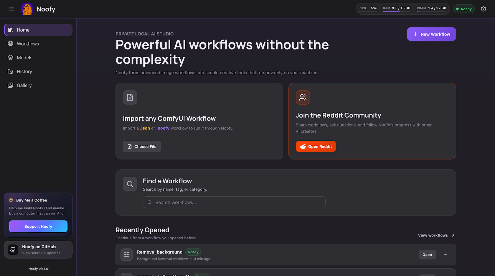
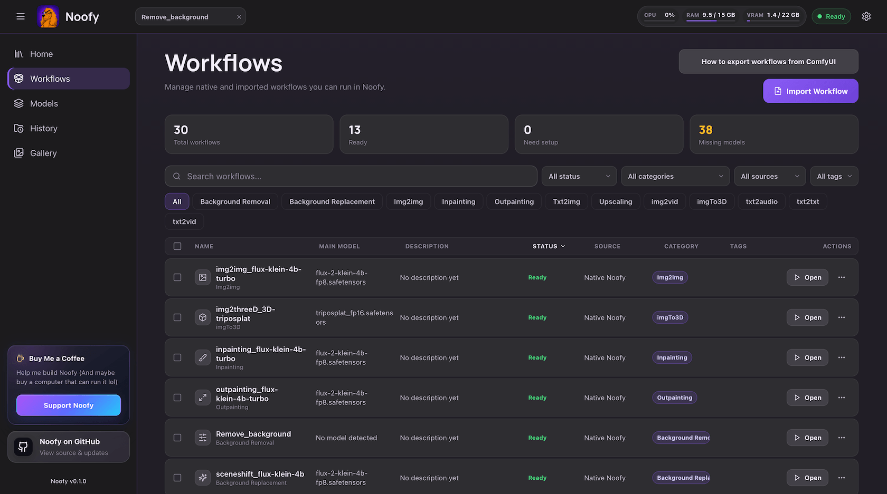
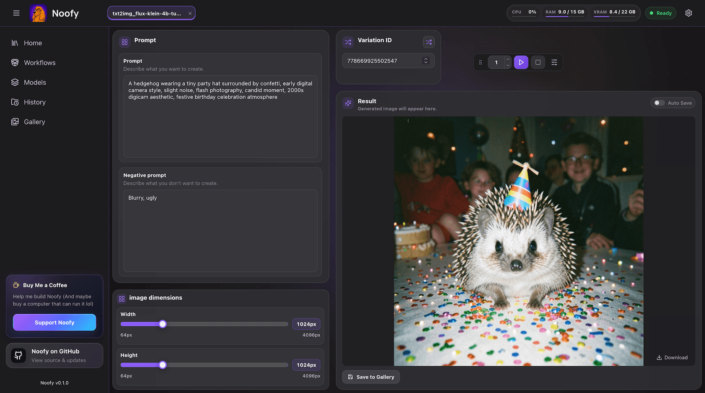
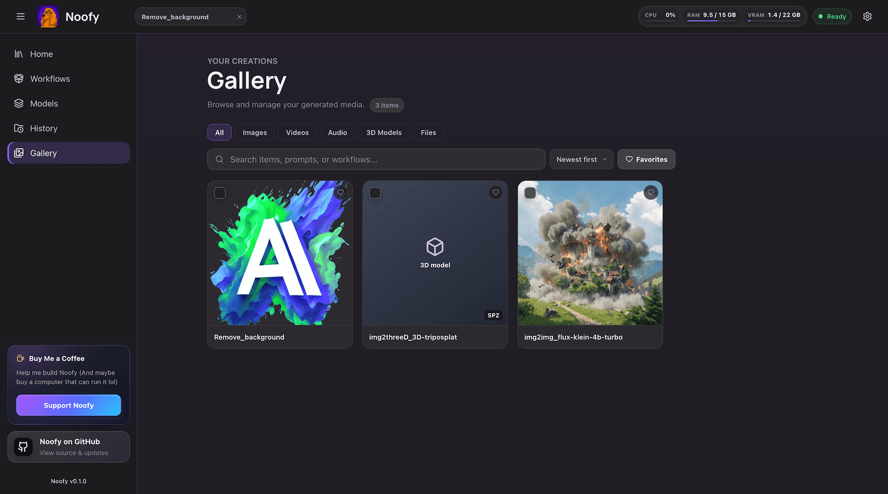
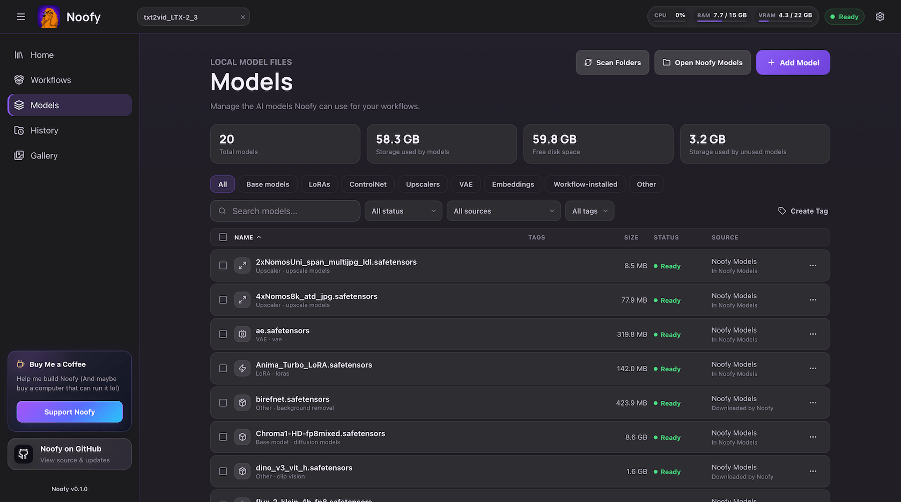
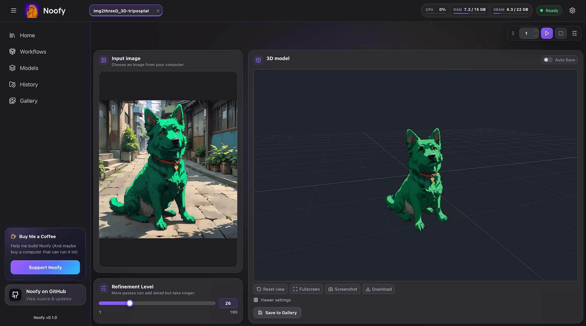

<p align="center">
  
</p>

<p align="center">
  
</p>

<div align="center">
  
  
  
  
  
  
</div>


# Noofy

**Turn powerful ComfyUI workflows into simple, local, app-like dashboards.**

Noofy is a desktop-first, local AI workflow app. It lets creators build or reuse
advanced workflows in ComfyUI, export them as `.noofy` packages, and turn them
into focused dashboards that normal users can run without touching a node graph.

ComfyUI remains the first execution engine behind the scenes. Noofy is the layer
around it: workflow import, dashboard design, model/runtime preparation, local
execution, and beginner-friendly controls.

## Why Noofy Exists

ComfyUI is powerful, but a raw ComfyUI workflow is not a good interface for most
people. It contains nodes, internal values, technical names, model paths,
custom-node assumptions, Python dependencies, and many parameters that should
not be edited casually.

Noofy keeps the ComfyUI graph as execution data and builds a curated dashboard
around it. The dashboard exposes only the values the creator or importer chooses
to make editable, such as:

- prompt
- input image
- transformation strength
- width and height
- style or LoRA choice
- seed / variation ID
- generated outputs

Noofy is not trying to replace ComfyUI as a workflow authoring tool. It exists
to make finished ComfyUI workflows feel like clean local apps.

## Who It Is For

- **Creators** who build workflows in ComfyUI and want to share them as usable
  tools instead of raw node graphs.
- **Importers and power users** who want to adapt community workflows into
  reliable local dashboards.
- **Normal users** who want to run local AI workflows without learning ComfyUI,
  Python environments, model folders, custom nodes, or backend setup.
- **Developers and server users** who want an open-source local workflow app
  with a clear terminal install path.

## Installing Noofy

With packaged installers:

| Platform | Installer | Download |
| --- | --- | --- |
| Windows | `.exe` | [Download for Windows](https://github.com/menahem121/Noofy/releases/latest/download/Noofy_0.1.1_Windows_x64-setup.exe) |
| macOS Apple Silicon | `.dmg` | [Download for macOS Apple Silicon](https://github.com/menahem121/Noofy/releases/latest/download/Noofy_0.1.1_MACOS_aarch64.dmg) |
| Linux | `.deb` | [Download for Linux](https://github.com/menahem121/Noofy/releases/latest/download/Noofy_0.1.1_LINUX_amd64.deb) |
| Linux portable | `.AppImage` | [Download AppImage](https://github.com/menahem121/Noofy/releases/latest/download/Noofy_0.1.1_LINUX_amd64.AppImage) |

## Core Workflow

1. **Build or load a workflow in ComfyUI.**
2. **Export it with the Noofy ComfyUI export extension.**
   The extension runs the workflow once and writes a `.noofy` package.
3. **Import the `.noofy` package into Noofy.**
   Noofy reads the archive as data and normalizes it into an app-owned workflow
   package.
4. **Choose dashboard widgets.**
   The creator/importer decides which workflow values become user-facing
   controls.
5. **Arrange and save the dashboard.**
   The saved dashboard becomes the normal user interface for that workflow.
6. **Run the workflow from the dashboard.**
   The normal user sees a simple tool, not ComfyUI internals.

## `.noofy` Packages

A `.noofy` package is richer than a raw ComfyUI JSON file. It can include:

- the execution-ready ComfyUI graph
- package metadata
- model references and identity hints
- custom-node information
- declared output kinds for generated image, audio, video, 3D, text, and generic file outputs
- export diagnostics
- creator-side hardware observations
- an initial dashboard schema

Raw ComfyUI JSON imports may still be useful, but they are degraded imports:
they usually need more dashboard setup and provide less information for runtime
preparation.

### Install the ComfyUI Export Node

This is optional. If you already use ComfyUI, the Noofy export node adds an
**Export to Noofy** action inside ComfyUI. Use it when you want to turn a
ComfyUI workflow into a `.noofy` package that can be imported into Noofy.

Please note that Noofy also supports regular `.json` workflows, but using the Noofy Export custom node is the recommended path.

From your ComfyUI folder, run:

```bash
cd ComfyUI/custom_nodes

git clone --depth 1 --filter=blob:none --sparse https://github.com/menahem121/Noofy.git noofy_tmp
cd noofy_tmp
git sparse-checkout set comfyui_export2noofy_node

cd ..
mv noofy_tmp/comfyui_export2noofy_node ./comfyui_export2noofy_node
rm -rf noofy_tmp
```

Restart ComfyUI after installing it.

## Dashboards

The dashboard is curated, not generated blindly.

A workflow may contain many editable values, but only a few usually belong in
the interface. Noofy may suggest controls, but the creator/importer is
responsible for deciding what the normal user should see.

Normal users should not see workflow nodes, raw node values, package internals,
custom-node details, runtime state, Python setup, or ComfyUI-specific concepts
unless they explicitly open advanced/developer details.

## Current Capabilities

Noofy currently includes foundations for:

- a React frontend and Python/FastAPI backend
- an app-owned engine contract with ComfyUI as the first adapter
- managed ComfyUI startup for local app use
- `.noofy` archive import and workflow package normalization
- dashboard widget selection and layout work
- model validation through the active engine adapter
- a user-visible Noofy Models folder (`~/Documents/Noofy Models`), optional reuse of an existing ComfyUI models folder, and Settings cards for the model folder and Hugging Face / Civitai API keys
- staged `.noofy` import that previews required models, downloads missing ones from Hugging Face or Civitai with progress and cancel, and only commits the workflow when the user is ready
- isolated workflow/runtime preparation for community workflows when possible
- structured diagnostics for runtime, install, workflow, and memory behavior
- a Noofy ComfyUI export extension

Noofy is still in active development. The V1 direction is a desktop app where
users open Noofy, choose a workflow dashboard, and run it locally without
manually launching ComfyUI or installing ComfyUI Python dependencies.

## Local Development

For advanced users, contributors, and Unix-like source checkouts:

**Important:** packaged Noofy should not need Python, Node, npm, ComfyUI, pip,
venv, Homebrew, Conda, or other developer tools. The section below is only for
people running from a source checkout.

### 1. Install Source-Build Tools

Noofy does not install these tools for you.

| Tool | Minimum | Recommended Install |
|------|---------|---------|
| Python | 3.11+ for the trusted source helper | [python.org](https://www.python.org/downloads) · Homebrew · distro package manager |
| Node.js + npm | LTS v18 | `brew install node` · [nodejs.org](https://nodejs.org/en/download) |

The managed ComfyUI runtime is separate from the trusted backend and currently
requires **Python 3.13**. The easiest source-checkout path is usually a
`uv`-managed Python, because distro packages may not provide exactly
`python3.13`.

### 2. Install Noofy

Linux/macOS:

```bash
git clone https://github.com/menahem121/Noofy
cd Noofy
make install
make run
```

Windows PowerShell:

```powershell
git clone https://github.com/menahem121/Noofy
cd Noofy
.\scripts\install.ps1
.\scripts\run.ps1
```

If the source install says the managed ComfyUI Python is missing, use the
platform-specific priority order below.

Linux/macOS:

```bash
# Priority 1: recommended, no sudo, does not change system Python
backend/.venv/bin/uv python install 3.13
COMFYUI_BOOTSTRAP_PYTHON_EXECUTABLE="$(backend/.venv/bin/uv python find 3.13)" make install
```

```bash
# Priority 2: Linux fallback, only if your distro provides Python 3.13
apt install python3.13 python3.13-venv
dnf install python3.13
COMFYUI_BOOTSTRAP_PYTHON_EXECUTABLE=python3.13 make install
```

```bash
# Priority 2: macOS fallback
brew install python@3.13
COMFYUI_BOOTSTRAP_PYTHON_EXECUTABLE="$(brew --prefix python@3.13)/bin/python3.13" make install
```

Windows PowerShell:

```powershell
# Priority 1: recommended, no admin shell needed
.\backend\.venv\Scripts\uv.exe python install 3.13
$py = .\backend\.venv\Scripts\uv.exe python find 3.13
$env:COMFYUI_BOOTSTRAP_PYTHON_EXECUTABLE = $py
.\scripts\install.ps1
```

```powershell
# Priority 2: Windows package manager fallback
winget install Python.Python.3.13
$py = py -3.13 -c "import sys; print(sys.executable)"
$env:COMFYUI_BOOTSTRAP_PYTHON_EXECUTABLE = $py
.\scripts\install.ps1
```

The source install command creates the trusted backend virtual environment,
installs frontend dependencies, and prepares Noofy's managed ComfyUI runtime
under `.noofy-runtime/data`.

For source/development checkouts, the managed ComfyUI runtime profile controls
its own Python ABI. If Python 3.13 is not available, the source install command
prints the same priority order shown above and a
`COMFYUI_BOOTSTRAP_PYTHON_EXECUTABLE=...` override. It does not install system
Python or run privileged commands.

On macOS Intel, `make install` still installs the source-checkout backend and
frontend dependencies, but managed ComfyUI runtime preparation is skipped with an
unsupported-platform message. Workflow execution that requires managed ComfyUI is
not available on that machine.

PyTorch and ComfyUI dependencies are installed into the managed runtime
environment, not globally and not into the trusted backend venv.

For backend-only/server use:

```bash
make run-backend
```

On Windows:

```powershell
.\scripts\run-backend.ps1
```

## Tests

Run the full test suite from the repo root:

```bash
make test
```

This runs backend tests, frontend tests, and the ComfyUI export extension tests.

## ComfyUI Export Extension

Noofy includes a ComfyUI extension in
[`comfyui_export2noofy_node/`](comfyui_export2noofy_node/).

To install it in a development ComfyUI checkout, copy or symlink the folder into
ComfyUI's `custom_nodes/` directory:

```text
ComfyUI/
  custom_nodes/
    comfyui_export2noofy_node/
```

Restart ComfyUI after installing it. The extension adds an **Export to Noofy**
action to the ComfyUI interface.

To export a workflow:

1. Open ComfyUI.
2. Load or build the workflow.
3. Click **Export to Noofy**.
4. Wait for the export test run to finish.
5. Save the downloaded `.noofy` package.

The exporter only creates a package after ComfyUI reports a successful test run.
It does not bundle model files, and it does not mark community workflows as
trusted or Noofy Verified.

See the [export extension README](comfyui_export2noofy_node/README.md) for the
full package format and exporter behavior.

## Importing And Configuring A Workflow

After importing a `.noofy` package, Noofy stores an internal editable copy of the
workflow package. The creator/importer can then:

1. inspect bindable workflow inputs and outputs
2. choose which values become dashboard widgets
3. name the widgets with user-friendly labels
4. arrange the dashboard layout
5. save the dashboard
6. run the workflow from the finished interface

The original imported `.noofy` archive is not silently modified. If a user wants
to share the configured workflow later, Noofy should export a new package.

## Trust, Safety, And Limitations

Community workflows can include custom nodes and Python dependencies. Noofy
prepares those through isolated runtime artifacts when it can, so one workflow's
dependencies do not mutate the trusted backend or the core ComfyUI runtime.

This is dependency and runtime isolation, not a full security sandbox. Noofy
does not claim that arbitrary Python code from the internet is safe. Unsupported
or unresolved workflows should fail gracefully with useful diagnostics instead
of asking beginners to repair Python, pip, folders, or ComfyUI internals.

## Developer Docs

- [Agent entry point](AGENTS.md)
- [Design system](DESIGN_SYSTEM.md)
- [Docs index](docs/README.md)
- [Architecture](docs/ARCHITECTURE.md)
- [Engine contract](docs/ENGINE_CONTRACT.md)
- [Workflow packages](docs/WORKFLOW_PACKAGES.md)
- [Dashboard architecture](docs/DASHBOARD_ARCHITECTURE.md)
- [Runtime isolation architecture](docs/RUNTIME_ISOLATION_ARCHITECTURE.md)
- [Managed ComfyUI sidecar](docs/MANAGED_COMFYUI_SIDECAR.md)
- [Packaged runtime](docs/PACKAGED_RUNTIME.md)
- [ComfyUI updates](docs/COMFYUI_UPDATES.md)
- [Noofy Verified publishing](docs/NOOFY_VERIFIED_PUBLISHING.md)
- [OS sandboxing feasibility](docs/OS_SANDBOXING_FEASIBILITY.md)
- [Memory Governor](docs/MEMORY_GOVERNOR.md)
- [Memory Governor Linux validation](docs/MEMORY_GOVERNOR_LINUX_VALIDATION.md)
- [Model resolution and downloads](docs/MODEL_RESOLUTION_AND_DOWNLOADS.md)
- [Model compatibility plan](docs/MODEL_COMPATIBILITY_PLAN.md)


## License

Noofy is licensed under the GNU General Public License v3.0. See
[LICENSE](LICENSE).

Noofy includes a vendored ComfyUI source snapshot under `third_party/comfyui/`.
ComfyUI is also licensed under the GNU General Public License v3.0. Its license
text is available at [third_party/comfyui/LICENSE](third_party/comfyui/LICENSE).
ComfyUI remains copyright of its respective authors.
